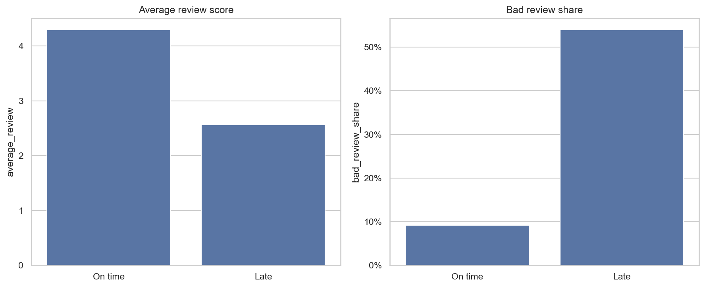
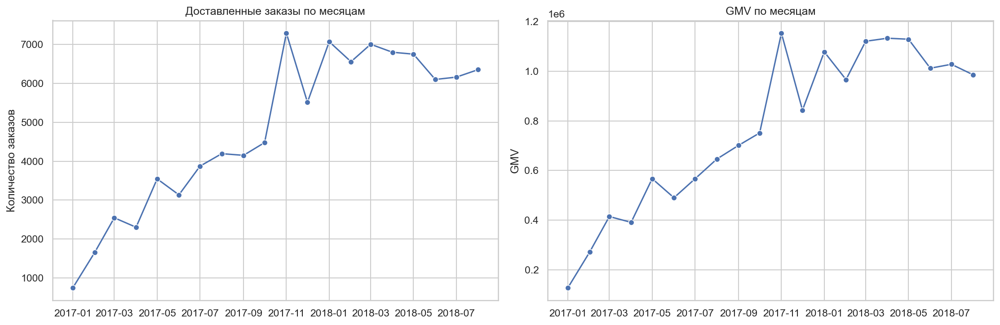
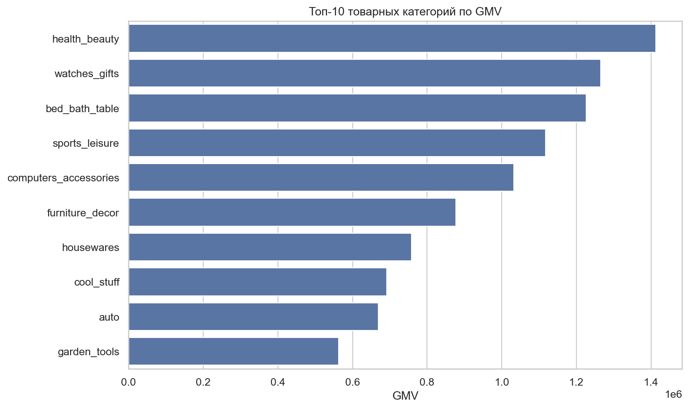
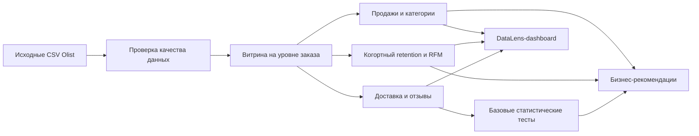
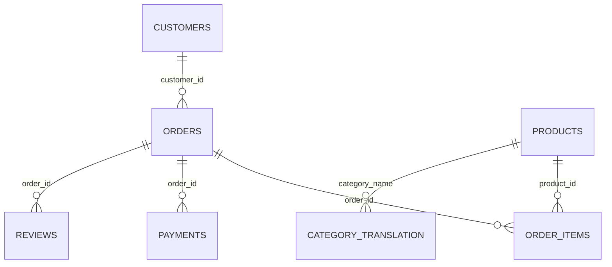

# Аналитика бразильского маркетплейса Olist

[](https://www.python.org/)
[](https://pandas.pydata.org/)
[](#)

Полный продуктовый анализ бразильского маркетплейса Olist. Проект посвящён динамике продаж, удержанию клиентов, RFM-сегментации, качеству доставки и отзывам покупателей.

## Краткое резюме

Маркетплейс получил **15,42 млн GMV** от **96 478 доставленных заказов**, однако только **3,00% клиентов совершили более одной покупки**. Качество доставки тесно связано с удовлетворённостью покупателей: доля плохих отзывов среди опоздавших заказов составляет **53,99%**, а среди доставленных вовремя — **9,19%**.

Основные точки роста — повышение конверсии во вторую покупку и сокращение числа опозданий.

## Ключевые результаты

| Метрика | Результат |
|---|---:|
| Доставленные заказы | 96 478 |
| Уникальные клиенты | 93 358 |
| GMV с учётом доставки | 15,42 млн |
| Средний чек | 159,83 |
| Доля повторных клиентов | 3,00% |
| Средняя оценка | 4,16 |
| Доля опоздавших доставок | 8,11% |
| Доля плохих отзывов: вовремя | 9,19% |
| Доля плохих отзывов: с опозданием | 53,99% |

## Бизнес-вопросы

1. Как меняются количество заказов и GMV со временем?
2. Какие категории товаров создают наибольший GMV?
3. Как часто клиенты возвращаются после первой покупки?
4. Какие клиентские сегменты следует считать приоритетными?
5. Связаны ли опоздания доставки с ухудшением отзывов?

## Основные выводы

### 1. Удержание клиентов — главное ограничение роста

Только **3,00%** клиентов оформили более одного доставленного заказа. Когортный retention также резко снижается после месяца первой покупки. Поэтому рост Olist в значительной степени зависит от постоянного привлечения новых клиентов.

### 2. Опоздание доставки тесно связано с плохими отзывами

| Статус доставки | Средняя оценка | Доля плохих отзывов |
|---|---:|---:|
| Вовремя | 4,29 | 9,19% |
| С опозданием | 2,57 | 53,99% |

Различия статистически значимы по результатам критерия хи-квадрат для доли плохих отзывов и t-критерия Уэлча для средней оценки. Поскольку данные являются наблюдательными, результат показывает связь, но не доказывает причинность.



### 3. RFM выделяет клиентские сегменты для практической работы

Недавние клиенты с одной покупкой представляют крупнейшую возможность для CRM-коммуникаций. Повторные клиенты с высокой ценностью встречаются редко, но важны для бизнеса, поэтому их необходимо удерживать с помощью программ лояльности и качественного сервиса.

### 4. Продажи и категории требуют регулярного мониторинга

Продажи по месяцам демонстрируют рост и сезонность. Ведущие товарные категории формируют значительную часть GMV маркетплейса.





## Рекомендации

- Запустить CRM-кампании для стимулирования второй покупки в течение 30–60 дней.
- Отслеживать опоздания и плохие отзывы по категориям и штатам клиентов.
- Заранее уведомлять клиентов о риске задержки заказа.
- Использовать DataLens-dashboard для регулярного мониторинга продаж, retention, доставки и отзывов.
- Проверять новые механики удержания и доставки с помощью реальных A/B-тестов.

## DataLens-dashboard

Для проекта подготовлены шесть компактных CSV-витрин и подробный макет дашборда в Yandex DataLens.

Предлагаемая структура:

| Страница | Основные показатели |
|---|---|
| Главное | GMV, заказы, клиенты, средний чек, повторные клиенты, опоздания |
| Продажи | динамика GMV и заказов, категории, средний чек |
| Retention и клиенты | когортный retention и RFM-сегменты |
| Доставка и отзывы | опоздания, плохие отзывы, оценки и штаты |

Готовые витрины находятся в папке [`datalens/data`](datalens/data), а пошаговая инструкция по сборке — в [`datalens/README.md`](datalens/README.md).

```bash
python src/prepare_datalens_data.py
```

Скрипт повторно создаёт все витрины DataLens из исходных CSV Olist.

## Схема анализа



## Статистические методы

В проекте намеренно используются методы, соответствующие уровню Junior / Junior+ аналитика:

- описательная статистика;
- когортный retention;
- RFM-сегментация;
- критерий хи-квадрат для проверки связи статуса доставки с плохим отзывом;
- t-критерий Уэлча для сравнения средних оценок.

Сложные методы причинно-следственного анализа и машинного обучения намеренно не включены в основную версию проекта.

## Структура репозитория

```text
olist-ecommerce-analytics/
├── data/
│   └── raw/
│       └── README.md
├── datalens/
│   ├── data/
│   └── README.md
├── notebooks/
│   └── olist_ecommerce_analysis.ipynb
├── reports/
│   ├── figures/
│   └── analytical_report.md
├── src/
│   ├── create_notebook.py
│   └── prepare_datalens_data.py
├── .gitignore
├── README.md
└── requirements.txt
```

## Локальный запуск

1. Клонируйте репозиторий.
2. Скачайте [Brazilian E-Commerce Public Dataset by Olist](https://www.kaggle.com/datasets/olistbr/brazilian-ecommerce).
3. Распакуйте CSV-файлы в папку `data/raw/`.
4. Установите зависимости:

```bash
python -m pip install -r requirements.txt
```

5. Откройте и выполните:

```text
notebooks/olist_ecommerce_analysis.ipynb
```

Notebook использует относительные пути и запускается из корня репозитория или папки `notebooks`.

## Модель данных



## Ограничения

- Данные являются историческими и наблюдательными, поэтому статистические связи не доказывают причинность.
- GMV включает стоимость товаров и доставки, но не отражает прибыль маркетплейса.
- В данных отсутствуют маркетинговые расходы, маржинальность и распределение по экспериментальным группам.
- Крайние месяцы представлены не полностью и исключены из графика динамики продаж.

## Материалы проекта

- [Выполненный notebook](notebooks/olist_ecommerce_analysis.ipynb)
- [Аналитический отчёт](reports/analytical_report.md)
- [Витрины и инструкция для DataLens](datalens/README.md)
- [Инструкция по загрузке датасета](data/raw/README.md)
