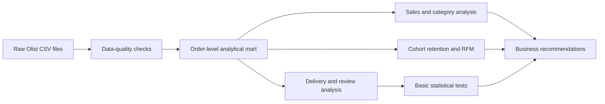
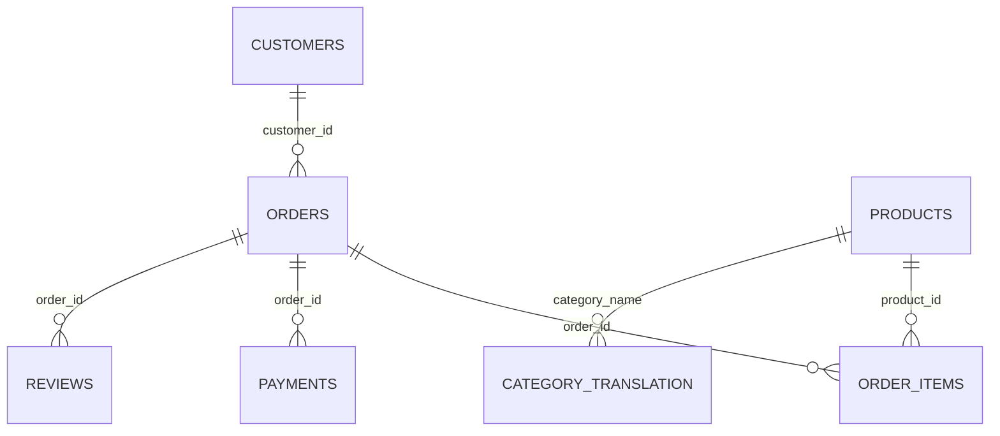

# Brazilian E-Commerce Analytics: Olist

[](https://www.python.org/)
[](https://pandas.pydata.org/)
[](#)

End-to-end product analytics project based on the Brazilian Olist marketplace dataset. The analysis focuses on sales dynamics, customer retention, RFM segmentation, delivery quality, and customer reviews.

## Executive Summary

The marketplace generated **15.42M GMV** from **96,478 delivered orders**, but only **3.00% of customers made more than one purchase**. Delivery quality is strongly associated with customer satisfaction: late orders have a **53.99% bad-review share**, compared with **9.19%** for orders delivered on time.

The main business opportunities are improving second-purchase conversion and reducing delivery delays.

## Key Results

| Metric | Result |
|---|---:|
| Delivered orders | 96,478 |
| Unique customers | 93,358 |
| GMV including freight | 15.42M |
| Average order value | 159.83 |
| Repeat customer rate | 3.00% |
| Average review score | 4.16 |
| Late delivery share | 8.11% |
| Bad-review share: on-time orders | 9.19% |
| Bad-review share: late orders | 53.99% |

## Business Questions

1. How are orders and GMV changing over time?
2. Which product categories generate the most GMV?
3. How often do customers return after their first purchase?
4. Which customer segments should the business prioritize?
5. Are late deliveries associated with worse customer reviews?

## Main Findings

### 1. Customer retention is the main growth limitation

Only **3.00%** of customers placed more than one delivered order. Cohort retention also drops sharply after the first purchase month. Olist growth therefore depends heavily on continuous customer acquisition.

### 2. Late delivery is strongly associated with poor reviews

| Delivery status | Average review | Bad-review share |
|---|---:|---:|
| On time | 4.29 | 9.19% |
| Late | 2.57 | 53.99% |

The difference is statistically significant under both a chi-square test for bad-review share and a Welch t-test for average review score. Since the dataset is observational, this result shows association rather than proven causality.


### 3. RFM highlights actionable customer groups

Recent one-time buyers form the largest CRM opportunity. Repeat high-value customers are rare but economically important and should be protected through loyalty and service-quality initiatives.

### 4. Sales and category performance require regular monitoring

Monthly sales show strong growth and seasonality. The leading product categories account for a meaningful share of marketplace GMV.


## Recommendations

- Launch CRM campaigns aimed at a second purchase within 30–60 days.
- Monitor late-delivery and bad-review shares by category and customer state.
- Proactively notify customers when an order is at risk of delay.
- Build a seller-quality dashboard combining delivery, cancellation, and review metrics.
- Validate new retention and delivery initiatives through real A/B tests.

## Analysis Workflow



## Statistical Methods

The project deliberately uses methods appropriate for a Junior / Junior+ analyst:

- descriptive statistics;
- cohort retention;
- RFM segmentation;
- chi-square test for association between delivery status and bad reviews;
- Welch t-test for difference in average review scores.

Complex causal-inference and machine-learning methods are intentionally outside the main project scope.

## Repository Structure

```text
olist-ecommerce-analytics/
├── data/
│   └── raw/
│       └── README.md
├── notebooks/
│   └── olist_ecommerce_analysis.ipynb
├── reports/
│   ├── figures/
│   └── analytical_report.md
├── src/
│   └── create_notebook.py
├── .gitignore
├── README.md
└── requirements.txt
```

## Run Locally

1. Clone the repository.
2. Download the [Brazilian E-Commerce Public Dataset by Olist](https://www.kaggle.com/datasets/olistbr/brazilian-ecommerce).
3. Extract the CSV files into `data/raw/`.
4. Install dependencies:

```bash
python -m pip install -r requirements.txt
```

5. Open and run:

```text
notebooks/olist_ecommerce_analysis.ipynb
```

The notebook uses relative paths and can be run from either the repository root or the `notebooks` directory.

## Data Model



## Limitations

- The dataset is historical and observational, so statistical associations do not prove causality.
- GMV includes product price and freight but does not represent marketplace profit.
- Marketing costs, margins, and experiment assignments are unavailable.
- Boundary months are incomplete and excluded from the sales-trend chart.

## Detailed Materials

- [Complete executed notebook](notebooks/olist_ecommerce_analysis.ipynb)
- [Analytical report](reports/analytical_report.md)
- [Dataset setup instructions](data/raw/README.md)

