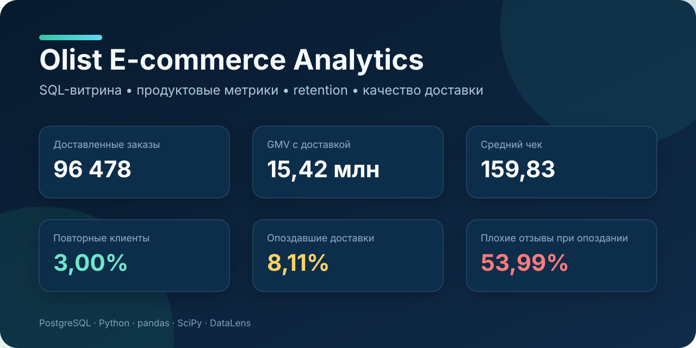
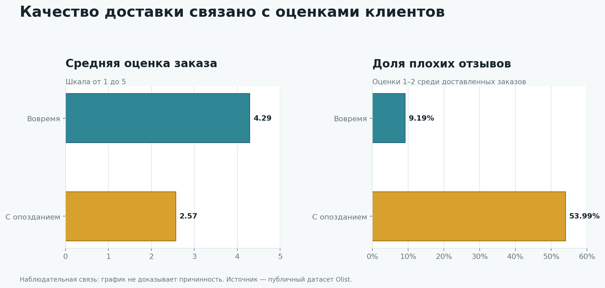

# Аналитика бразильского маркетплейса Olist



> End-to-end e-commerce analysis: PostgreSQL order mart, sales, retention, RFM, delivery quality and customer reviews.

## Кратко

Проект отвечает на два управленческих вопроса: где маркетплейс создаёт оборот и что мешает клиентам возвращаться. Анализ объединяет проверку качества данных, SQL-витрину на уровне заказа, Python-исследование, статистику и подготовленные витрины для DataLens.

Главный результат: **96 478 доставленных заказов** принесли **15,42 млн GMV**, но повторную покупку совершили только **3,00% клиентов**. Среди опоздавших заказов доля плохих отзывов достигла **53,99%** против **9,19%** у доставленных вовремя.

## Бизнес-задача

Определить, какие категории и периоды формируют оборот, насколько устойчиво клиенты возвращаются после первой покупки и где качество доставки создаёт риск для удовлетворённости и повторных продаж.

## Основные результаты

| Метрика | Результат |
|---|---:|
| Заказы в исходной таблице | 99 441 |
| Доставленные заказы | 96 478 |
| Уникальные клиенты | 93 358 |
| GMV с учётом доставки | 15,42 млн |
| Средний чек | 159,83 |
| Клиенты с повторной покупкой | 3,00% |
| Опоздавшие доставки | 8,11% |
| Средняя оценка: вовремя / с опозданием | 4,29 / 2,57 |
| Плохие отзывы: вовремя / с опозданием | 9,19% / 53,99% |

- Retention резко снижается после месяца первой покупки: рост зависит от постоянного привлечения новых клиентов.
- Опоздание связано с более низкой оценкой и большей долей плохих отзывов. Это наблюдательная связь, а не доказательство причинности.
- RFM в этом датасете в основном разделяет клиентов по давности и чеку: при 3% повторных покупателей частотность слабо дифференцирует базу.

## Рекомендации

- Тестировать CRM-механику второй покупки в течение 30–60 дней после первого заказа.
- Ввести мониторинг опозданий и плохих отзывов по категориям, продавцам и штатам.
- Заранее уведомлять клиента о риске задержки и измерять влияние коммуникации экспериментом.
- Не использовать RFM-сегменты как готовую стратегию лояльности без проверки на новых продуктовых данных.

## Дашборд

В проекте подготовлены шесть компактных CSV-витрин для DataLens: executive KPI, продажи, категории, retention, RFM, доставка и отзывы.



[Открыть витрины и инструкцию DataLens](datalens/README.md)

## Данные

- Источник: [Brazilian E-Commerce Public Dataset by Olist](https://www.kaggle.com/datasets/olistbr/brazilian-ecommerce).
- Период заказов: 2016–2018 годы; крайние месяцы представлены неполно.
- Основная гранулярность аналитической витрины: **одна строка = один заказ**.
- Исходные CSV не хранятся в Git; инструкция загрузки находится в [`data/raw/README.md`](data/raw/README.md).

## Проверки качества данных

- Проверена уникальность `order_id` в таблице заказов и итоговой витрине.
- Проверены дубликаты, пропуски и допустимые статусы заказов.
- Платежи и позиции заказа агрегируются до JOIN, чтобы не размножать строки.
- Количество строк витрины сверено с количеством уникальных заказов: `99 441 = 99 441`.
- Метрики Python и PostgreSQL сверены между собой.
- Для retention используется устойчивый идентификатор клиента `customer_unique_id`.
- Выбросы не удаляются автоматически; ограничения и неполные периоды фиксируются отдельно.

## Методология

1. Исходные таблицы проверяются и приводятся к согласованным типам.
2. Платежи, товары и отзывы агрегируются до уровня заказа.
3. Формируется order-level mart без размножения строк.
4. Рассчитываются GMV, AOV, динамика продаж, категории и повторные покупки.
5. Retention считается от месяца первой доставленной покупки.
6. Клиенты сегментируются по RFM.
7. Связь опоздания и оценки проверяется критерием хи-квадрат и t-критерием Уэлча.

## SQL

SQL вынесен из notebook в отдельные проверяемые файлы:

- [`02_data_quality.sql`](sql/02_data_quality.sql) — качество и целостность;
- [`03_create_order_mart.sql`](sql/03_create_order_mart.sql) — витрина на уровне заказа;
- [`04_executive_kpis.sql`](sql/04_executive_kpis.sql) — основные KPI;
- [`08_cohort_retention.sql`](sql/08_cohort_retention.sql) — когортный retention;
- [`10_rfm_segments.sql`](sql/10_rfm_segments.sql) — RFM.

[Открыть навигатор по SQL и логику расчётов](sql/README.md)

## Ограничения

- Данные относятся к одному маркетплейсу и ограниченному историческому периоду.
- Нельзя установить причинную связь между задержкой и оценкой без эксперимента или квазиэкспериментального дизайна.
- GMV включает товары и доставку, но не отражает прибыль и маржинальность.
- Нет стоимости привлечения, каналов маркетинга и данных о CRM-коммуникациях.
- Один человек мог использовать разные идентификаторы; `customer_unique_id` снижает, но не исключает этот риск.

## Стек

`PostgreSQL` · `SQL` · `Python` · `pandas` · `SciPy` · `Matplotlib` · `Seaborn` · `Jupyter` · `Yandex DataLens`

## Как запустить

```bash
git clone https://github.com/sureasguuds9-prog/olist-ecommerce-analytics.git
cd olist-ecommerce-analytics
python -m venv .venv
source .venv/bin/activate
pip install -r requirements.txt
```

Скачайте датасет по ссылке выше, поместите CSV в `data/raw/` и откройте [`notebooks/olist_ecommerce_analysis.ipynb`](notebooks/olist_ecommerce_analysis.ipynb).

Для PostgreSQL:

```bash
createdb olist_analytics
psql -d olist_analytics -f sql/00_create_tables.sql
psql -d olist_analytics -f sql/01_import_csv.sql
psql -d olist_analytics -f sql/03_create_order_mart.sql
```

## Материалы

- [Выполненный notebook](notebooks/olist_ecommerce_analysis.ipynb)
- [Аналитический отчёт](reports/analytical_report.md)
- [SQL и воспроизведение](sql/README.md)
- [Рассказ о проекте для интервью](docs/interview_story.md)
